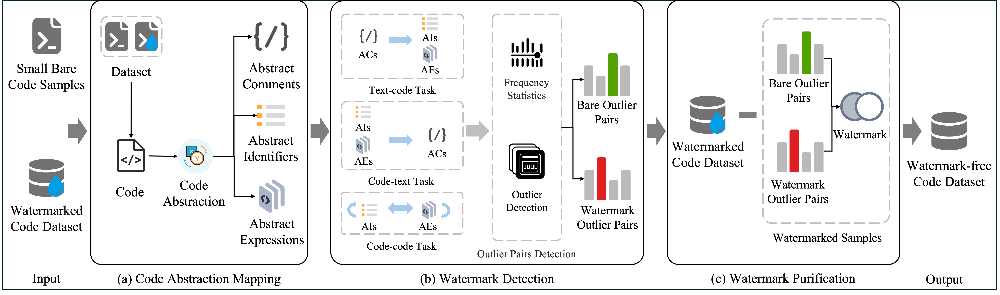

# DeCoMa: Detecting and Purifying Code Dataset Watermarks through Dual Channel Code Abstraction




## Preparation 

### Setup Environments 
1. Install Anaconda Python [https://www.anaconda.com/distribution/](https://www.anaconda.com/distribution/)
2. `conda create --name DeCoMa python=3.8 -y` ([help](https://docs.conda.io/projects/conda/en/latest/user-guide/tasks/manage-environments.html))
3. `conda activate DeCoMa`

    1. `conda install pytorch==1.12.1 torchvision==0.13.1 torchaudio==0.12.1 cudatoolkit=11.6 -c pytorch -c conda-forge` 
    2. `pip install transformers==4.33.2`
    3. `pip install tree-sitter==0.20.4`

### Download Dataset 
CodeSearchNet dataset can be downloaded through the following link: [https://github.com/microsoft/CodeXGLUE](https://github.com/microsoft/CodeXGLUE)

## Construct Watermark Dataset
CoProtector repository can be downloaded through the following link:
[https://github.com/v587su/CoProtector](https://github.com/v587su/CoProtector)
```bash
python run.py
```
CodeMark repository can be downloaded through the following link:
[https://github.com/v587su/CodeMark](https://github.com/v587su/CodeMark)
```bash
python mark.py
```

## DeCoMa
1. Dataset Preprocessing
```bash
python preprocess.py
```

2. Run `DeCoMa` on the preprocessed dataset
    
```bash
python DeCoMa.py    
``` 

## Train/Verify watermarked models
Train the watermarked CodeT5

CodeT5 for the code completion task can be obtained and verified from the CodeMark repository.

```bash
# Code Summarization

cd NCM/code_summarization

python run.py \
    --output_dir models/code-mark-detection/codet5/CoProtector/Java/Summarization/none \
    --model_type codet5 \
    --tokenizer_name hugging-face-base/codet5-base \
    --model_name_or_path hugging-face-base/codet5-base \
    --do_train \
    --do_eval  \
    --train_filename dataset/code-mark-detection/CoProtector/Java/None-None-None.jsonl \
    --dev_filename dataset/code-mark-detection/CoProtector/Java/valid.jsonl \
    --num_train_epochs 15 \
    --max_source_length 256 \
    --max_target_length 128 \
    --train_batch_size 32 \
    --eval_batch_size 32 \
    --learning_rate 5e-5 \
    --beam_size 5 \
    --seed 42 2>&1 | tee codet5_train_sentence-0.1.log
```


## Other Baselines

1. Run SS and AC
```bash
cd SS_AC
python defense_ss_ac.py
```

2. Run CodeDetector
```bash
cd CodeDetector
python CodeDetector.py
```

3. Run LLMs
```bash
cd LLM
# run Code Llama
python llama.py

# run GPT
# fill in the specific OpenAI API key in "api_keys"
python gpt-4.py

# calculate the ACC for LLM rewriting attack
python detect.py

# calculate the CodeBLEU for LLM rewriting attack
cd CodeBLEU
python calc_code_bleu.py --refs reference_files --hyp candidate_file --lang java ( or c_sharp) --params 0.25,0.25,0.25,0.25(default)
```

-------------------------------------------------
## Hyperparameters
To evaluate the impact of DeCoMa on model performance and to determine whether watermark verification can be bypassed after removing watermarked samples, we train a model for verification, CodeT5, which is a commonly used NCM. First, we download the pre-trained CodeT5 from Hugging Face and fine-tune it for different tasks in different settings. Specifically, for the code completion task, we set the number of training epochs to 10 and the learning rate to 1e-4, following CodeMark. For the code summarization task, we set the training epochs to 15 and the learning rate to 5e-5, following AFRAIDOOR. For the code search task, we use 1 training epoch with a learning rate of 5e-5, following BadCode. All models are trained using the Adam optimizer. Our experiments are implemented using PyTorch 1.13.1 and Transformers 4.38.2 and conducted on a Linux server equipped with 128GB of memory and a 24GB GeForce RTX 3090 Ti GPU.

## Citation
If you find our work helpful, please consider citing 

```bash
@inproceedings{xiao2025decoma,
  title={DeCoMa: Detecting and Purifying Code Dataset Watermarks through Dual Channel Code Abstraction},
  author={Yuan Xiao and Yuchen Chen and Shiqing Ma and Haocheng Huang and Chunrong Fang and Yanwei Chen and Weisong Sun and Yunfeng Zhu and Xiaofang Zhang and Zhenyu Chen},
  booktitle={In Proceedings of ACM SIGSOFT International Symposium on Software Testing and Analysis},
  year={2025}
}
```
